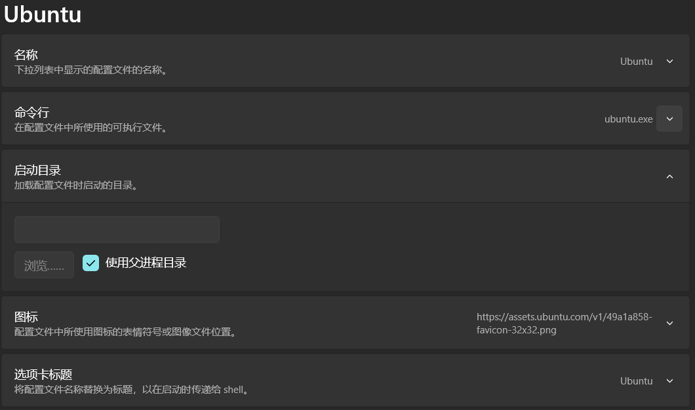
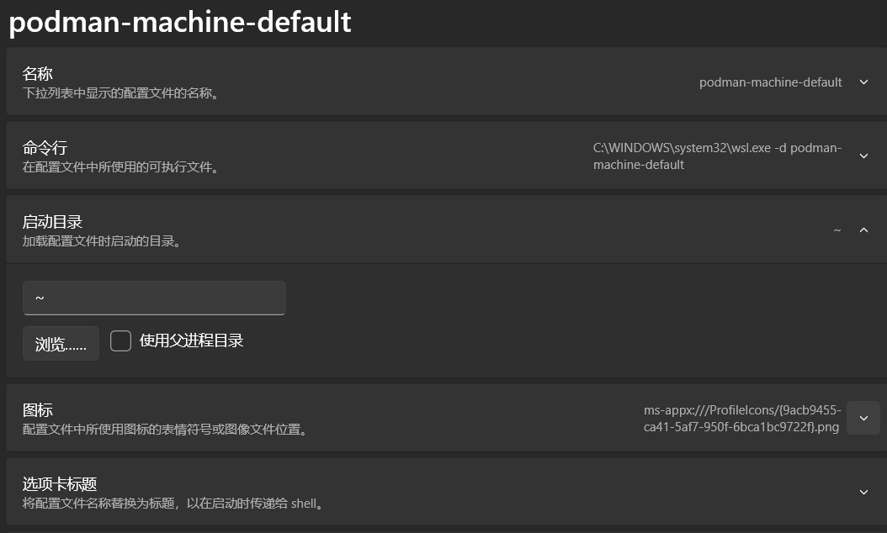

---
tags:
  - 环境
date: 2024-11-24
publish: true
---


## 微软相关服务无法登录

最近，我也遇到了微软相关服务无法登录的问题。尝试了网上几乎所有的方法，包括禁用复用网卡、网络重置、禁用复用服务，以及修改注册表中的某些设置，但都没有效果。特别是在 Windows 10 18362 版及其之后的版本中，取消上网验证通常并不能解决问题。

### 原因分析

经过对注册表选项的比对，发现问题出在联网返回值功能的变化上。原理是每当联网后，系统会自动向微软的 `http://dns.msftncsi.com` 发出请求，然后返回一个 `NCSI.txt` 的值。如果这个值正确，则确认已联网。然而，在 Windows 10 最近的版本中，这个返回服务器和值发生了变化，并反映在六个注册表项中。这些变化由于国内部分运营商的网络重定向，导致无法得到正确反馈，因此出现实际能上网却显示为无 Internet 的问题。

### 解决方法

下图展示了更新 Win10 后被系统错误修改的注册表项：


而下图则是 Win10 18362 版之前正确的注册表项：


请将被选中标成蓝色的项改回为图中所显示的值，并确保 `EnableActiveProbing` 恢复为 `1`。重启系统后，网络应该能够恢复正常。我已经在多台电脑上测试过此方法，希望它能顺利解决大家的问题。

具体需要修改的注册表路径为：  
`\\HKEY_LOCAL_MACHINE\\SYSTEM\\CurrentControlSet\\Services\\NlaSvc\\Parameters\\Internet`

---


备份 UserFolder 下的配置文件、ssh密钥等
备份 Documents 文件夹（有配置文件）
备份 Windows-Terminal json
clash-verge-rev、webdav恢复配置
powertoys
windows-terminal
vscode（git默认最为舒适）
scoop导入，管理便携版，方便config
winget等其他方式补充，随用随配置
windowspowershell + busybox

## windows-terminal

修改快捷键，新终端为 ctrl-shift-n，关闭为 ctrl-w。
### 自定义profile





只要是在命令行中运行产生新shell的命令，就都可以写一个profile。填在命令行那块儿。例如mingw、cygwin、conda、ssh、docker run等等。可以当成一个xshell！

```
ssh hyj0824@192.168.1.17
```

## powershell

### 准备工作

使用 Windows PowerShell 5.0 或 5.1 更新 PSReadLine 通常有两个步骤。首先，您需要确保您运行的是 `1.6.0` 或更高版本的 PowerShellGet。为此，您需要在提升的 Windows PowerShell 会话中运行以下命令。

```powershell
Install-Module -Name PowerShellGet -Force
```

接下来，确保关闭所有 PowerShell 会话，并在提升的 `cmd.exe` 提示符下运行以下代码。这是从 `cmd.exe` 运行的原因是，默认情况下，PSReadLine 已加载，如果在内存中则无法更新。

```powershell
powershell -noprofile -command "Install-Module PSReadLine -Force -SkipPublisherCheck -AllowPrerelease"
```

ref：[在 PowerShell 中使用 PSReadLine](https://cn.linux-console.net/?p=7394)

安装其他必要的 Module

```powershell
Install-Module git-posh
```

### 修改 $profile

```powershell
function runlinux{
	docker run -it --rm -v Files:/root maxxing/compiler-dev bash
}

Import-Module PSReadLine
Set-PSReadlineKeyHandler -Chord Tab -Function MenuComplete
Set-PSReadLineOption -PredictionSource History -PredictionViewStyle ListView
# set Ctrl-D/d
Set-PSReadlineKeyHandler -Chord Ctrl+d,Ctrl+D -Function DeleteLine

# winget 补全参数
Register-ArgumentCompleter -Native -CommandName winget -ScriptBlock {
    param($wordToComplete, $commandAst, $cursorPosition)
        [Console]::InputEncoding = [Console]::OutputEncoding = $OutputEncoding = [System.Text.Utf8Encoding]::new()
        $Local:word = $wordToComplete.Replace('"', '""')
        $Local:ast = $commandAst.ToString().Replace('"', '""')
        winget complete --word="$Local:word" --commandline "$Local:ast" --position $cursorPosition | ForEach-Object {
            [System.Management.Automation.CompletionResult]::new($_, $_, 'ParameterValue', $_)
        }
}
# git 补全参数
Import-Module posh-git
```

### PowerShell 链接

软链接（符号链接）

```
New-Item -ItemType SymbolicLink -Path "新建的符号链接文件或文件夹路径" -Target "源文件或源文件夹"
```

硬链接（仅文件）

```
New-Item -ItemType HardLink -Path "新建的硬链接文件路径" -Target "源文件"
```

## windows 快速黑屏

scrnsave.scr
