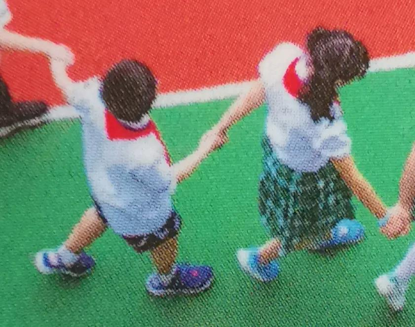
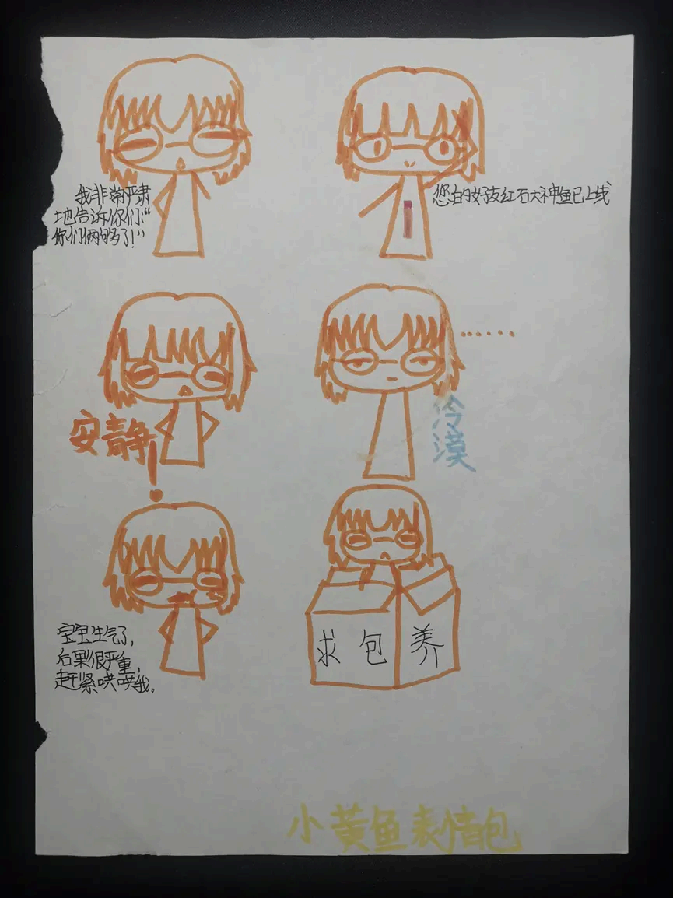
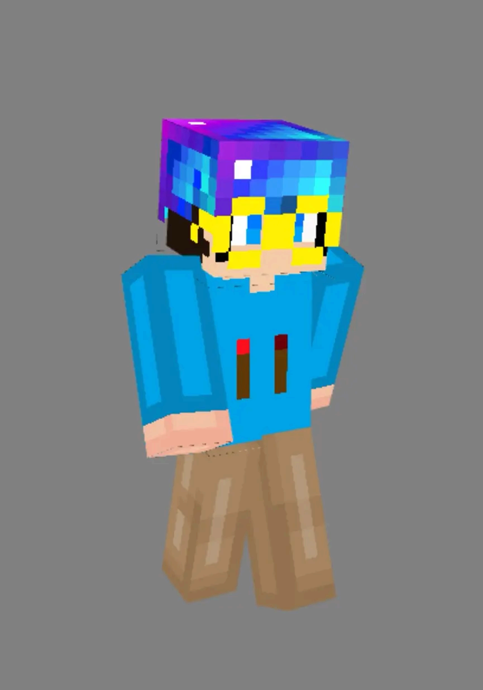
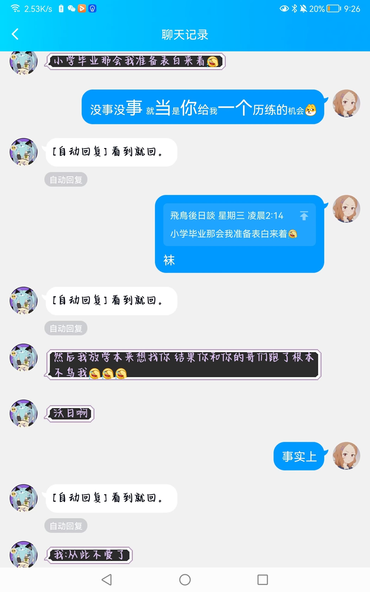
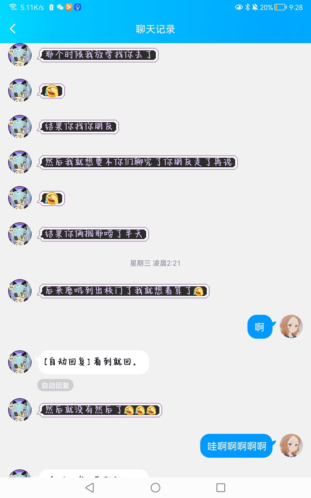
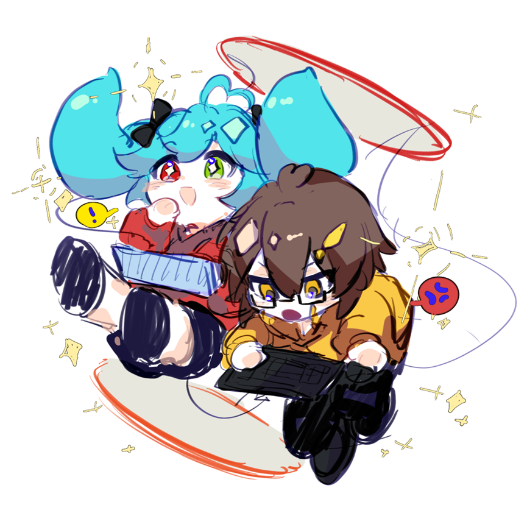

---
tags:
  - 回忆
date: 2024-08-27
publish: true
---



总说自己是嘴上的巨人，行动的矮子，不错，事实也确实印证了这一点。曾也满怀信心立下写回忆录的flag，几曾拖延，从打算大写特写，到步入高中，才写了零星几个片段。

这两年真的过的像梦一样。陌生的城市，陌生的同学，先是浑噩走过一年竞赛，又熬过了收效甚微的半年高二。经历确实是丰富了不少，但说不上顺利。总像是暮色降临时鸟倦飞而知还，迷茫与挫折总让人身心俱疲，坎坎坷坷中，总会寻求一些东西慰藉心灵。这些文字，修修补补，也如温暖的家，风平浪静的港湾一般，在困顿中给予我一份前进的力量。

你，还好吧……没想我也曾情窦初开，被荷尔蒙所胁，给你带来了不少困扰。不过也总算明白，我喜欢的只是曾经那些日子，和那个总能治愈我的她--那个唤作小草的可爱女孩。

虽然之前给你看过，但还是想把这首诗当作一份给你，也是给我的生日礼物吧，送给那个在我记忆中，永远不会长大的小女孩和小男孩，让她和他在那片无忧无虑的天地，成为我恒久而有力的精神寄托。

祝你18岁生日快乐！历经万难，你也终于是一名女高了呢～还有我们一定都要顺顺利利，开开心心。

```
我说，小草，
如果有什么可以代表你——
是肩背上那抹柠檬绿，
承托着少年无处安放的手臂。
是那随风拂动的刘海，
无心勾在你粉嫩的笑脸。
是飞舞的双马尾，
搅动着懵懂的内心。
是飞扬的画笔，
描画着成长与努力。
想要再一次故意惹你生气，
在教室走廊间上演一场猫抓老鼠。
想要再一次假意喊你帮忙，
最后一起在那棵老银杏树下聊天散步。
想要再一次等你一起下楼，
在不经意间偷偷搭上你的肩膀。
想要再一次凑在你的身后偷听，
把额头轻埋在肩，细嗅着发丝清香。
想要再一次感受脸颊近如咫尺，
害羞地四目相对，进退着极限拉扯。
想再一次收到你亲手做的蛋糕，
再一次被你抢走笔袋，
再一次看你画画，惹你生气，
然后再一次被你抓住。
如果可以——
我想回到合影的那天，
牢牢攥紧你的手，
用心感受你掌心的温度；
回到毕业那天，
回到那个
还在传唱着纸短情长的夏天，
站在那楼梯口等你，等你……
```

要是没记错的话，第一次见面，应当是二年级吧。我和她同班，甚至还在同一个社团--管乐队。想起有次上社团课，她拿了一只飞蛾吓唬我，我当时胆子小点，被吓得慌不择路地逃跑。不得不说，曾经的她可剽悍了（狗头保命 但是别的词好像又不太恰当 要不换成活泼开朗？）

还记得后来一次课上，她趁休息时间把我拉到墙角，她红着脸颊，轻声说：“你知道吗，”她顿了顿说，“我喜欢你。”我的脑子一时半会儿没反应过来，也不知道答复什么好，只好害羞地跑到一旁。说实话，我后来也没有搞清楚，这是真心话，还是在玩真心话大冒险，毕竟是很遥远的事了。

好吧，不得不承认，这件事好像只有我记得了。毕竟从某种意义上讲，是第一次被别人表白（笑）

后来上了三年级，她退了社团，我心里却总是惦记着，她为什么不来了。后来在大伙儿起哄下，虽然嘴上说着她喜欢我，而我心里又不明所以地喜欢着她。遂有几人找我（逼我）确认，竟也扭捏着答了喜欢。没成想这几个反手取出录音机，嚷嚷着要给她听……如果没记错的话录音记录下的话应该是：

“你喜欢xxx吗？快说”

“喜欢啊，怎么了”（好尴尬）

想起那些和她在一起度过的体育课，不是在操场上走走停停，就是坐在角落看着她画画；还有每次都要故意嘴贫惹她生气，被她追来追去满楼道跑，最后还是得被她勾住脖颈狠狠挨一下。以及我那个黄色的橡胶笔袋儿，经常被她抢走甩来甩去，追着她跑，直到上课才要的回来。

我喜欢在课间看着她画画。有时她会和同学围在一起聊天，还记得有一次我凑过去，站在她的后面，踮起脚尖往里面看，还把头靠在她的右肩上，心里还砰砰跳个不停（笑）

不过最最开始我肯定是怯于这种很亲密的动作的……要说最开始，也许是她先盘弄我的头发，拿个卡子夹住我的刘海；也许是摸摸我的头，勾着我肩膀一起走什么的；或者是被她追上以后锁住脖颈，连追逐的喘息都能用脸颊感受……直到后来有次放学，我那不听话的左手，犹豫半天终于偷偷地勾到了她的……那个绿色的苦力怕书包上。从那以后慢慢就不害羞了（笑）甚至有次我还戳了戳她的脸（这算占人便宜了哈哈哈）

为数不多的几次，或是被她捉住盯着我，或是她坐在我桌前注视着我……四目相对许久，我故意向她的脸颊贴近，而她向后仰去；随即又调转过来，她向我靠近一点，我向后闪去一点……这时候谁来推一下就好玩了233

也曾与她分过许多吃喝，被同学们开过什么间接kiss的玩笑——或许是哪天放学后买的一根烤面筋，某次考试表彰发的香米酥，可能还有半瓶酸奶？

还记得你帮我一起打扫大队部，我还不小心弄湿了你的鞋。那天夕阳斜照，我们一起看那棵参天的银杏，洒落下金箔般的银杏叶。你告诉我说，你初中可能要到浙江去。而我却只能走那条大多数人都要去走的路。我不舍得分别，但我也无力改变。不过有幸，故乡和你，都好好的还在那里。

感谢你送给我的外号（或者网名？）--小黄鱼……也不知缘由为何，要么是我当时穿了个黄色的衣服，要么是我文具袋是黄色的（也有可能我说过些不太健康的段子）然后再加上我的姓谐音来的。（ps. 我爸最近钓的小黄鱼油炸完了还挺好吃的hhh）



当年陪我打mc，后来还帮我捏mc皮肤的时候，手机上才把java版的很多红石方块搬过来呢。当时的我闭门造车，研究红石和指令，还被戏称红石大神鱼（虽然最后连个活塞电梯都没做出来）如今的mojang和mc也开始走下坡路了啊……



还记得那个小铁盒子，被你细心的签上留言，装满了你亲手做的小蛋糕--那是我第一次收到女孩子的礼物。也不知道回送给你什么好，听说你喜欢安迷修（当时我还专门跑去补了半天凹凸世界）索性就买了个立牌，外带一些小零食，挑了一天偷偷塞给你。

说到害羞，小时候也不太敢约你出来玩（我一直都不太会安排这些…），唯一的那次还叫了别人一起，最后挑的片子也不是很好，不了了之。你叫我放学一起去买几个凹凸世界的周边，我翻箱倒柜才找了个钱包带上。

三言两语，恨纸短情长，不再多言。现在来看，互相错过何尝不是扯平了呢……本非天造地设，又何求比翼连理呢，还是相信一切都是最好的安排吧。最后，愿天天开心，诸事顺意。





（顺便安利一下她的画……


